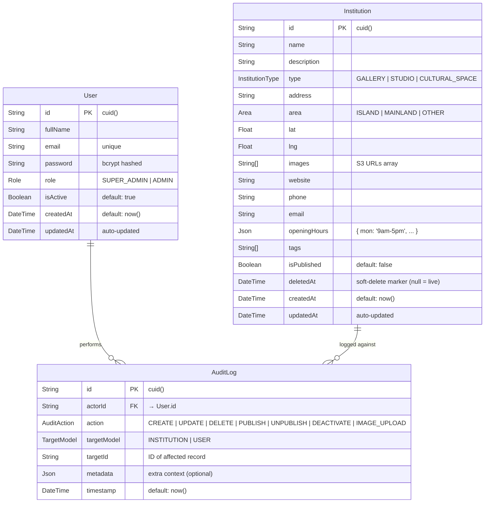

# Art Explore — Database Relationship Diagram

**Stack:** PostgreSQL via Prisma ORM
**Generated for:** Art Explore Backend Project

---

## Entity Relationship Diagram



---

## Relationship Summary

| Relationship | Type | Description |
|---|---|---|
| User → AuditLog | One-to-Many | Every admin action is traced to the user who performed it via `actorId` |
| Institution → AuditLog | Logical (via targetId) | When `targetModel = INSTITUTION`, `targetId` references an Institution record |
| User → AuditLog | Logical (via targetId) | When `targetModel = USER`, `targetId` references a User record (e.g. deactivation) |

> Note: `AuditLog.targetId` is a generic string reference, not a hard FK. This allows a single AuditLog table to track actions against both `Institution` and `User` records, determined by the `targetModel` enum field.

---

## Enums

### Role
| Value | Description |
|---|---|
| `SUPER_ADMIN` | Full access — can manage admin accounts and all content |
| `ADMIN` | Can manage institution content only |

### InstitutionType
| Value | Description |
|---|---|
| `GALLERY` | Art gallery |
| `STUDIO` | Artist studio |
| `CULTURAL_SPACE` | Cultural centre or space |

### Area
| Value | Description |
|---|---|
| `ISLAND` | Lagos Island |
| `MAINLAND` | Lagos Mainland |
| `OTHER` | Anywhere else |

### AuditAction
| Value | Trigger |
|---|---|
| `CREATE` | New institution or user created |
| `UPDATE` | Institution or user record updated |
| `DELETE` | Soft delete (deletedAt timestamp set) |
| `PUBLISH` | Institution published |
| `UNPUBLISH` | Institution unpublished |
| `DEACTIVATE` | Admin user deactivated |
| `IMAGE_UPLOAD` | Image uploaded to S3 and attached |

### TargetModel
| Value | Description |
|---|---|
| `INSTITUTION` | AuditLog entry targets an Institution |
| `USER` | AuditLog entry targets a User |

---

## Upstash Redis (Not in Prisma Schema)

Redis is used outside the relational schema for two purposes:

| Key Pattern | Value | TTL | Purpose |
|---|---|---|---|
| `refresh:{userId}` | Hashed refresh token | 7 days | Refresh token store — deleted on logout |
| `cache:institutions:{queryHash}` | JSON string | 60s | Response cache for GET /api/institutions |
| `cache:institutions:map` | JSON string | 60s | Response cache for GET /api/institutions/map |

---

## Prisma Schema Reference

```prisma
model User {
  id        String     @id @default(cuid())
  fullName  String
  email     String     @unique
  password  String
  role      Role       @default(ADMIN)
  isActive  Boolean    @default(true)
  auditLogs AuditLog[]
  createdAt DateTime   @default(now())
  updatedAt DateTime   @updatedAt
}

model Institution {
  id           String          @id @default(cuid())
  name         String
  description  String?
  type         InstitutionType
  address      String
  area         Area
  lat          Float
  lng          Float
  images       String[]
  website      String?
  phone        String?
  email        String?
  openingHours Json?
  tags         String[]
  isPublished  Boolean         @default(false)
  deletedAt    DateTime?
  createdAt    DateTime        @default(now())
  updatedAt    DateTime        @updatedAt
}

model AuditLog {
  id          String      @id @default(cuid())
  actorId     String
  actor       User        @relation(fields: [actorId], references: [id])
  action      AuditAction
  targetModel TargetModel
  targetId    String
  metadata    Json?
  timestamp   DateTime    @default(now())
}
```

---

*Art Explore — DB Schema Reference | Confidential*
