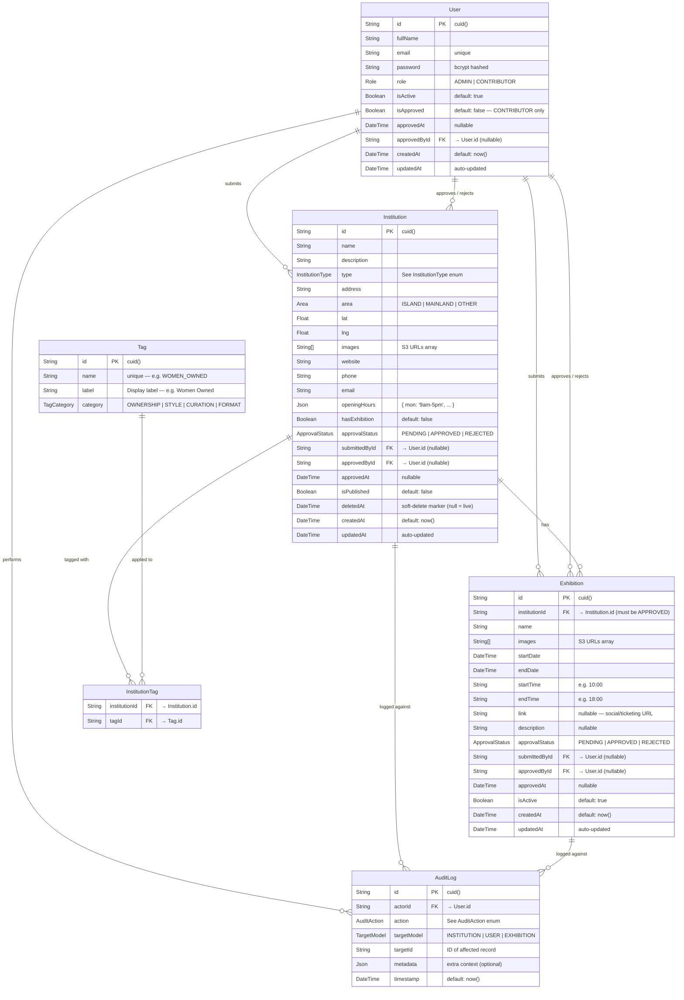

# Art Explore — Database Relationship Diagram v2

**Stack:** PostgreSQL via Prisma ORM
**Generated for:** Art Explore Backend Project
**Version:** 2.1
**Based on:** ArtExplore_DB_Diagram.md (v1)

---

## What Changed from v1 — Deviation Summary

| # | Area | v1 | v2 | Reason |
|---|------|----|----|--------|
| 1 | `User.role` enum | `SUPER_ADMIN \| ADMIN` | `ADMIN \| CONTRIBUTOR` | Collapsed super admin into ADMIN. Added public-facing CONTRIBUTOR role for gallery submitters |
| 2 | `User` — approval fields | Not present | `isApproved`, `approvedAt`, `approvedById` added | Admin must approve/reject new CONTRIBUTOR accounts before they can submit |
| 3 | `InstitutionType` enum | `GALLERY \| STUDIO \| CULTURAL_SPACE` | 6 values — see enum table | Expanded to include Museums, Institutes, Foundations per brief |
| 4 | `Institution` — submission tracking | Not present | `submittedById`, `approvalStatus`, `approvedById`, `approvedAt` added | Galleries can now be submitted by CONTRIBUTORs and require admin approval |
| 5 | `Institution` — exhibition flag | Not present | `hasExhibition` Boolean added | Every institution carries a flag; if true, linked Exhibition records apply |
| 6 | `Institution.tags` | `String[]` free-form | Replaced by `InstitutionTag` junction + `Tag` model | Enforces a controlled vocabulary for reliable filtering/sorting |
| 7 | `Exhibition` model | Does not exist | New model | Holds name, images, dates, times, link, description per institution |
| 8 | `Tag` model | Does not exist | New model | Predefined tag registry with categories |
| 9 | `InstitutionTag` junction | Does not exist | New junction table | Many-to-many between Institution and Tag |
| 10 | `AuditAction` enum | 7 values | 14 values | Added APPROVE/REJECT actions for users, institutions, and exhibitions |
| 11 | `TargetModel` enum | `INSTITUTION \| USER` | Added `EXHIBITION` | AuditLog can now trace exhibition-level actions |
| 12 | `ApprovalStatus` enum | Does not exist | New enum | `PENDING \| APPROVED \| REJECTED` — shared by Institution and Exhibition submissions |
| 13 | `Exhibition` — submission tracking | Not present | `submittedById`, `approvalStatus`, `approvedById`, `approvedAt` added | CONTRIBUTORs can submit exhibitions against existing approved galleries; admin approval required |

---

## Entity Relationship Diagram



---

## Relationship Summary

| Relationship | Type | Description |
|---|---|---|
| User → Institution (submitted) | One-to-Many | A CONTRIBUTOR or ADMIN can submit many institution records |
| User → Institution (approved) | One-to-Many | An ADMIN approves or rejects institution submissions |
| User → Exhibition (submitted) | One-to-Many | A CONTRIBUTOR or ADMIN can submit exhibitions against existing approved institutions |
| User → Exhibition (approved) | One-to-Many | An ADMIN approves or rejects exhibition submissions |
| User → User (approvedBy) | Self-referencing | An ADMIN approves/rejects CONTRIBUTOR accounts |
| Institution → Exhibition | One-to-Many | An institution with `hasExhibition = true` may have many Exhibition records — institution must be `APPROVED` before exhibitions can be submitted |
| Institution ↔ Tag | Many-to-Many | Via `InstitutionTag` junction — an institution can carry multiple tags |
| User → AuditLog | One-to-Many | Every action is traced to the acting user via `actorId` |
| Institution → AuditLog | Logical (via targetId) | When `targetModel = INSTITUTION`, `targetId` references an Institution |
| Exhibition → AuditLog | Logical (via targetId) | When `targetModel = EXHIBITION`, `targetId` references an Exhibition |
| User → AuditLog | Logical (via targetId) | When `targetModel = USER`, `targetId` references a User (e.g. approval, rejection) |

> Note: `AuditLog.targetId` remains a generic string reference (not a hard FK) to allow a single table to span all target types, discriminated by `targetModel`.

---

## Enums

### Role *(CHANGED from v1)*
| Value | Description |
|---|---|
| `ADMIN` | Full platform access — manages galleries, users, content. Acts as super admin. No separate SUPER_ADMIN tier. |
| `CONTRIBUTOR` | Public user — can register, submit institution galleries via form, submit exhibitions against existing approved galleries, and view own submissions. Requires admin approval of account before access. |

> **Deviation:** v1 had `SUPER_ADMIN \| ADMIN` (two internal staff tiers). v2 collapses to one `ADMIN` role (the admin is always the super admin) and introduces `CONTRIBUTOR` as the accurate name for the public-facing user role.

---

### InstitutionType *(EXPANDED from v1)*
| Value | Display Label | Description | Status |
|---|---|---|---|
| `ART_GALLERY` | Art Gallery | Commercial or non-profit gallery exhibiting visual art | **New** |
| `MUSEUM` | Museum | Public institution preserving and exhibiting collections | **New** |
| `INSTITUTE` | Institute | Educational or research institution focused on the arts | **New** |
| `FOUNDATION` | Foundation | Non-profit arts foundation or grant-making body | **New** |
| `STUDIO` | Artist Studio | Working studio space, open or by appointment | Retained from v1 |
| `CULTURAL_SPACE` | Cultural Space | Multi-purpose cultural centre or community arts space | Retained from v1 |

> **Deviation:** v1 had 3 types. v2 has 6. `GALLERY` was renamed `ART_GALLERY` for precision.

#### Recommended additions — *Client Question Below*
| Suggested Value | Display Label | Rationale |
|---|---|---|
| `AUCTION_HOUSE` | Auction House | Major part of the Lagos art market (e.g. Arthouse) |
| `ART_FAIR` | Art Fair | Recurring events like Art X Lagos warrant their own type |
| `PRIVATE_COLLECTION` | Private Collection | Growing trend of collector-led spaces |
| `RESIDENCY` | Artist Residency | Residency programmes as a distinct discoverable category |

**Draft question for client:**
> *"We've structured institution types as: Art Gallery, Museum, Institute, Foundation, Artist Studio, and Cultural Space. We also recommend adding Auction House, Art Fair, Private Collection, and Artist Residency. Do any of these not apply to your platform, or are there types specific to your market we should include?"*

---

### ApprovalStatus *(NEW — shared by Institution and Exhibition)*
| Value | Description |
|---|---|
| `PENDING` | Default state when a gallery or exhibition is submitted — awaiting admin review |
| `APPROVED` | Admin has approved the submission — eligible for publishing |
| `REJECTED` | Admin has rejected the submission — contributor is notified |

---

### Area *(unchanged from v1)*
| Value | Description |
|---|---|
| `ISLAND` | Lagos Island |
| `MAINLAND` | Lagos Mainland |
| `OTHER` | Anywhere else |

---

### TagCategory *(NEW)*
| Value | Description |
|---|---|
| `OWNERSHIP` | Who owns or leads the space |
| `STYLE` | Artistic style or medium |
| `CURATION` | Editorial picks or platform designation |
| `FORMAT` | Type of experience or programming format |

---

### Predefined Tags *(NEW — registered in `Tag` table)*

| `name` (slug) | `label` | `category` | Status |
|---|---|---|---|
| `WOMEN_OWNED` | Women Owned | `OWNERSHIP` | From brief |
| `BLACK_OWNED` | Black Owned | `OWNERSHIP` | Recommended |
| `ARTIST_LED` | Artist Led | `OWNERSHIP` | Recommended |
| `LIVE_EXHIBITION` | Live Exhibition | `FORMAT` | From brief |
| `BY_APPOINTMENT` | By Appointment | `FORMAT` | Recommended |
| `ONLINE` | Online | `FORMAT` | Recommended |
| `OUR_PICKS` | Our Picks | `CURATION` | From brief |
| `NEW_ARRIVAL` | New Arrival | `CURATION` | Recommended |
| `FEATURED` | Featured | `CURATION` | Recommended |
| `CONTEMPORARY` | Contemporary | `STYLE` | From brief |
| `MODERN` | Modern | `STYLE` | Recommended |
| `PHOTOGRAPHY` | Photography | `STYLE` | Recommended |
| `SCULPTURE` | Sculpture | `STYLE` | Recommended |
| `DIGITAL_ART` | Digital Art | `STYLE` | Recommended |
| `TEXTILE` | Textile & Fabric | `STYLE` | Recommended — strong in West African art market |
| `MIXED_MEDIA` | Mixed Media | `STYLE` | Recommended |

> Tags are seeded at deployment. Admins can extend the list via the control panel.

**Draft question for client:**
> *"For filtering galleries we've proposed these tags: Women Owned, Black Owned, Artist Led, Live Exhibition, By Appointment, Online, Our Picks, New Arrival, Featured, Contemporary, Modern, Photography, Sculpture, Digital Art, Textile & Fabric, and Mixed Media. Are there any you'd remove, rename, or add — particularly any styles or designations specific to the Lagos/West African art scene?"*

---

### AuditAction *(EXPANDED from v1)*
| Value | Trigger | Status |
|---|---|---|
| `CREATE` | New institution or user created | Retained |
| `UPDATE` | Institution or user record updated | Retained |
| `DELETE` | Soft delete (deletedAt set) | Retained |
| `PUBLISH` | Institution published | Retained |
| `UNPUBLISH` | Institution unpublished | Retained |
| `DEACTIVATE` | User deactivated | Retained |
| `IMAGE_UPLOAD` | Image uploaded to S3 | Retained |
| `APPROVE_USER` | Admin approves a CONTRIBUTOR account | **New** |
| `REJECT_USER` | Admin rejects a CONTRIBUTOR account | **New** |
| `APPROVE_INSTITUTION` | Admin approves a gallery submission | **New** |
| `REJECT_INSTITUTION` | Admin rejects a gallery submission | **New** |
| `EXHIBITION_CREATE` | Exhibition record created | **New** |
| `EXHIBITION_UPDATE` | Exhibition record updated | **New** |
| `EXHIBITION_DELETE` | Exhibition record removed | **New** |
| `APPROVE_EXHIBITION` | Admin approves an exhibition submission | **New** |
| `REJECT_EXHIBITION` | Admin rejects an exhibition submission | **New** |

---

### TargetModel *(EXPANDED from v1)*
| Value | Description | Status |
|---|---|---|
| `INSTITUTION` | AuditLog entry targets an Institution | Retained |
| `USER` | AuditLog entry targets a User | Retained |
| `EXHIBITION` | AuditLog entry targets an Exhibition | **New** |

---

## Admin Control Panel — Capabilities Matrix

| Capability | ADMIN | CONTRIBUTOR |
|---|---|---|
| View all institutions in database | Yes | No |
| Create / submit institution | Yes | Yes (pending approval) |
| Edit any institution | Yes | Own submissions only |
| Update any institution | Yes | Own submissions only |
| Delete any institution | Yes | No |
| Publish / unpublish institution | Yes | No |
| Approve / reject institution submission | Yes | No |
| Submit exhibition for an existing approved gallery | Yes | Yes (pending approval) |
| Edit own exhibition submission | Yes | Own submissions only |
| Approve / reject exhibition submission | Yes | No |
| Delete any exhibition | Yes | No |
| View all users | Yes | No |
| Approve / reject user accounts | Yes | No |
| Deactivate users | Yes | No |
| View audit logs | Yes | No |
| Manage tags (add/remove) | Yes | No |

---

## Contributor — Two Submission Paths

An approved CONTRIBUTOR can take one of two actions from their dashboard:

| Path | Description | Constraint |
|---|---|---|
| **Add a Gallery** | Fill the Institution Upload Form to submit a new gallery for admin review | No prior dependency — any approved contributor may submit |
| **Add an Exhibition** | Fill the Exhibition Form to submit an exhibition tied to an existing gallery | The target institution must already exist and have `approvalStatus = APPROVED` |

> A contributor cannot create an exhibition for a gallery they just submitted — the gallery must first be approved by admin. This prevents orphaned exhibitions linked to rejected or pending institutions.

---

## Institution Submission Flow

```
CONTRIBUTOR registers
        ↓
Admin reviews account → APPROVE or REJECT
        ↓ (if approved)
CONTRIBUTOR fills Institution Upload Form
        ↓
Institution created → approvalStatus = PENDING, isPublished = false
        ↓
Admin reviews submission
        ↓
APPROVE → approvalStatus = APPROVED  (admin may then set isPublished = true)
REJECT  → approvalStatus = REJECTED  (contributor notified)
```

> Admins bypass the approval queue — institutions they create are set to APPROVED and can be published directly.

---

## Exhibition Submission Flow

```
CONTRIBUTOR selects "Add an Exhibition"
        ↓
System presents dropdown/search of institutions where approvalStatus = APPROVED
        ↓
CONTRIBUTOR selects an institution and fills Exhibition Form
        ↓
Exhibition created → approvalStatus = PENDING, isActive = false
        ↓
Admin reviews exhibition submission
        ↓
APPROVE → approvalStatus = APPROVED, isActive = true
          Institution.hasExhibition set to true (if not already)
REJECT  → approvalStatus = REJECTED  (contributor notified)
```

> Admins can create exhibitions directly on any approved institution without going through the approval queue.

---

## Exhibition Logic

```
Institution.hasExhibition = false  →  No active Exhibition records
Institution.hasExhibition = true   →  One or more approved Exhibition records linked
```

Each `Exhibition` record stores:
- **Name** — exhibition title
- **Images** — one or more S3-hosted images
- **Start / End Date** — date range
- **Start / End Time** — daily hours (e.g. 10:00–18:00)
- **Link** — social media or ticketing URL (optional)
- **Description** — curatorial note or summary (optional)

> A single institution can run multiple concurrent or sequential exhibitions. The `isActive` flag on Exhibition marks whether it is currently running.

---

## Upstash Redis *(unchanged from v1)*

Redis is used outside the relational schema for two purposes:

| Key Pattern | Value | TTL | Purpose |
|---|---|---|---|
| `refresh:{userId}` | Hashed refresh token | 7 days | Refresh token store — deleted on logout |
| `cache:institutions:{queryHash}` | JSON string | 60s | Response cache for GET /api/institutions |
| `cache:institutions:map` | JSON string | 60s | Response cache for GET /api/institutions/map |

---

## Prisma Schema Reference

```prisma
enum Role {
  ADMIN
  CONTRIBUTOR
}

enum InstitutionType {
  ART_GALLERY
  MUSEUM
  INSTITUTE
  FOUNDATION
  STUDIO
  CULTURAL_SPACE
}

enum Area {
  ISLAND
  MAINLAND
  OTHER
}

enum ApprovalStatus {
  PENDING
  APPROVED
  REJECTED
}

enum TagCategory {
  OWNERSHIP
  STYLE
  CURATION
  FORMAT
}

enum AuditAction {
  CREATE
  UPDATE
  DELETE
  PUBLISH
  UNPUBLISH
  DEACTIVATE
  IMAGE_UPLOAD
  APPROVE_USER
  REJECT_USER
  APPROVE_INSTITUTION
  REJECT_INSTITUTION
  EXHIBITION_CREATE
  EXHIBITION_UPDATE
  EXHIBITION_DELETE
  APPROVE_EXHIBITION
  REJECT_EXHIBITION
}

enum TargetModel {
  INSTITUTION
  USER
  EXHIBITION
}

model User {
  id                    String       @id @default(cuid())
  fullName              String
  email                 String       @unique
  password              String
  role                  Role         @default(CONTRIBUTOR)
  isActive              Boolean      @default(true)

  // Contributor approval — null for ADMIN accounts
  isApproved            Boolean      @default(false)
  approvedAt            DateTime?
  approvedById          String?
  approvedBy            User?        @relation("UserApproval", fields: [approvedById], references: [id])
  approvedUsers         User[]       @relation("UserApproval")

  // Institutions submitted or approved by this user
  submittedInstitutions Institution[] @relation("InstitutionSubmitter")
  approvedInstitutions  Institution[] @relation("InstitutionApprover")

  // Exhibitions submitted or approved by this user
  submittedExhibitions  Exhibition[]  @relation("ExhibitionSubmitter")
  approvedExhibitions   Exhibition[]  @relation("ExhibitionApprover")

  auditLogs             AuditLog[]
  createdAt             DateTime     @default(now())
  updatedAt             DateTime     @updatedAt
}

model Institution {
  id              String          @id @default(cuid())
  name            String
  description     String?
  type            InstitutionType
  address         String
  area            Area
  lat             Float
  lng             Float
  images          String[]
  website         String?
  phone           String?
  email           String?
  openingHours    Json?
  hasExhibition   Boolean         @default(false)

  // Submission & approval
  approvalStatus  ApprovalStatus  @default(PENDING)
  submittedById   String?
  submittedBy     User?           @relation("InstitutionSubmitter", fields: [submittedById], references: [id])
  approvedById    String?
  approvedBy      User?           @relation("InstitutionApprover", fields: [approvedById], references: [id])
  approvedAt      DateTime?

  isPublished     Boolean         @default(false)
  deletedAt       DateTime?

  tags            InstitutionTag[]
  exhibitions     Exhibition[]

  createdAt       DateTime        @default(now())
  updatedAt       DateTime        @updatedAt
}

model Exhibition {
  id              String         @id @default(cuid())
  institutionId   String
  institution     Institution    @relation(fields: [institutionId], references: [id])
  name            String
  images          String[]
  startDate       DateTime
  endDate         DateTime
  startTime       String
  endTime         String
  link            String?
  description     String?

  // Submission & approval — mirrors Institution flow
  approvalStatus  ApprovalStatus @default(PENDING)
  submittedById   String?
  submittedBy     User?          @relation("ExhibitionSubmitter", fields: [submittedById], references: [id])
  approvedById    String?
  approvedBy      User?          @relation("ExhibitionApprover", fields: [approvedById], references: [id])
  approvedAt      DateTime?

  isActive        Boolean        @default(false)
  createdAt       DateTime       @default(now())
  updatedAt       DateTime       @updatedAt
}

model Tag {
  id           String          @id @default(cuid())
  name         String          @unique
  label        String
  category     TagCategory
  institutions InstitutionTag[]
}

model InstitutionTag {
  institutionId String
  institution   Institution @relation(fields: [institutionId], references: [id])
  tagId         String
  tag           Tag         @relation(fields: [tagId], references: [id])

  @@id([institutionId, tagId])
}

model AuditLog {
  id          String      @id @default(cuid())
  actorId     String
  actor       User        @relation(fields: [actorId], references: [id])
  action      AuditAction
  targetModel TargetModel
  targetId    String
  metadata    Json?
  timestamp   DateTime    @default(now())
}
```

---

*Art Explore — DB Schema Reference v2.1 | Confidential*
*Supersedes ArtExplore_DB_Diagram.md (v1)*
